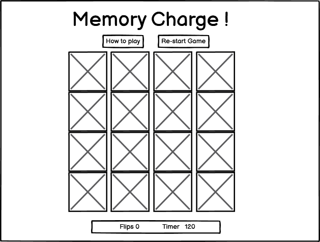

[View the live project here.](https://jennydelaney.github.io/Portfolio-Project-2/)

This is a memory game created by Jenny Delaney. It is designed to be responsive and accessible on a range of devices, making it easy to navigate and is geared towards children aged up to 12 years.

## User Experience (UX)User Experience (UX)
### User storiesUser stories
- The user should see a grid style game with 16 cards on display - these cards will have a front and back image.
- The user should only be able to click on two cards at a time, to try to find a matching pair.
- The user should have the option to reset the game at any time during play.
- By playing this game the user should be able to test their memory skill in a fun environment.

## Design
### Colour Scheme
Colour scheme is blue and pink.  

#### Imagery
Imagery is important. The images are fun pictures of pets which children can relate to.

## Wireframes
### Main Page Wireframe

## Features

-   Responsive on all device sizes.  On mobile the user may need to reposition and center the game.

-   Interactive elements

## Technologies Used

### Languages Used

-   [HTML5](https://en.wikipedia.org/wiki/HTML5)
-   [CSS3](https://en.wikipedia.org/wiki/Cascading_Style_Sheets)
-   [JavaScript](https://en.wikipedia.org/wiki/JavaScript)

### Frameworks, Libraries & Programs Used

1. [Git](https://git-scm.com/)
    - Git was used for version control by utilizing the Gitpod terminal to commit to Git and Push to GitHub.
2. [GitHub:](https://github.com/)
    - GitHub is used to store the projects code after being pushed from Git.
3. [Pexels:](https://www.pexels.com)
    - Photos were download from this site of pet animals for the game.
4. [Balsamiq:](https://balsamiq.com/)
    - Balsamiq was used to create the [wireframes](https://github.com/) during the design process.
5. [Word:]
    - Used to create the card back-image.

## Testing

The W3C Markup Validator and W3C CSS Validator Services were used to validate every page of the project to ensure there were no syntax errors in the project.

-   [W3C Markup Validator](https://jigsaw.w3.org/css-validator/#validate_by_input) - 
[Results - 36 Warnings about self closing tags.  These were removed. Validator returned Clear.
-   [W3C CSS Validator](https://jigsaw.w3.org/css-validator/#validate_by_input) - [Results](https://github.com/)
-   [JavaScript Validator](https://jshint.com/)

### Testing User Stories from User Experience (UX) Section

-  

### Further Testing

-   The Website was tested on Google Chrome, Microsoft Edge and Safari browsers.
-   The website was viewed on a variety of devices such as Desktop, Laptop, iPad, iPhone 8 & iPhone XR.
-   A large amount of testing was done to ensure game responded as expected.
-   Friends and family members were asked to review the site and documentation to point out any bugs and/or user experience issues.

### Known Bugs

-   On mobile devices the game board needs to be squeezed and reposition slightly to fit in the screen.
-   A white gap can be seen to the bottom of some monitor screens depending on how big they are.

## Deployment

### GitHub Pages

The project was deployed to GitHub Pages using the following steps...

1. Log in to GitHub and locate the [GitHub Repository](https://github.com/)
2. At the top of the Repository (not top of page), locate the "Settings" Button on the menu.
    - Alternatively Click [Here](https://raw.githubusercontent.com/) for a GIF demonstrating the process starting from Step 2.
3. Scroll down the Settings page until you locate the "GitHub Pages" Section.
4. Under "Source", click the dropdown called "None" and select "Master Branch".
5. The page will automatically refresh.
6. Scroll back down through the page to locate the now published site [link](https://github.com) in the "GitHub Pages" section.

## Credits

### Code

-   The game function code was written while following a tutorial by Marina Ferreira (https://marina-ferreira.github.io/tutorials/js/memory-game/)

-   The modal code was followed on W3Schools webiste (https://www.w3schools.com/howto/howto_css_modals.asp) and amended to work.

### Content

-   All content was written by the developer.

### Media

-   All Images used on the card front and the background image were taken from Pexels.com website.
-   The back of the card was created in word by the developer.

### Acknowledgements

-   My Mentor for continuous helpful feedback.